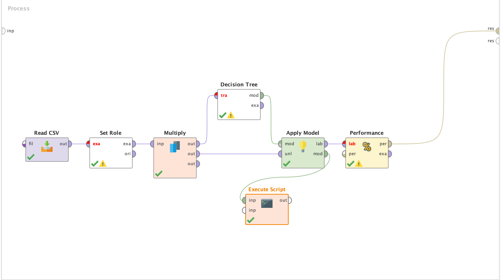
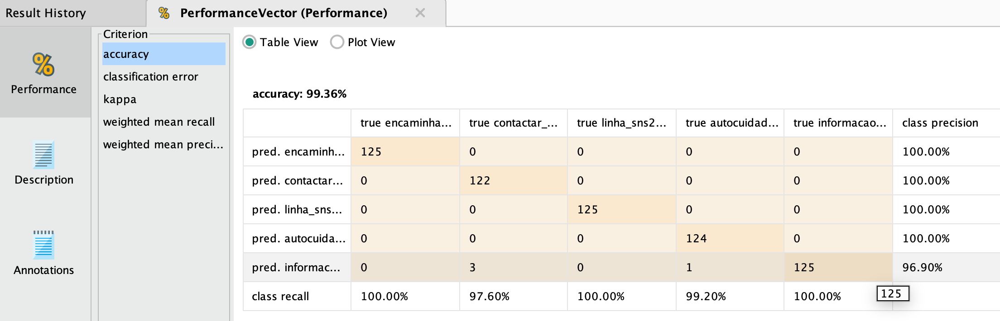

# Projeto P1 — Sistema Baseado em Conhecimento (SBC) para Triagem SNS24

**Unidade Curricular:** Técnicas de Inteligência Artificial (TIA)
**Ano Letivo:** 2025/2026

**Grupo:**
- Nuno Alves — nº _____
- Luís Sousa — nº _____
- Rui Mendes — nº _____

---

<!-- ============================================================
     CAPA  (1 página)
     ============================================================ -->
\newpage

# Índice

> _Iniciar em página ímpar. Paginação em romano (III, IV, …)._

1. Introdução
   1.1 Enquadramento
   1.2 Objetivos
2. Execução do Projeto
3. Tarefa P1A — SBC de Triagem
4. Tarefa P1MAX — Mecanismo de Explicação
5. Tarefa P1B — Aprendizagem Indutiva (RapidMiner)
6. Conclusões
   6.1 Síntese
   6.2 Discussão
   6.3 Funcionamento do Trabalho em Grupo

Apêndices
- Anexo A — Código desenvolvido
- Anexo B — Contrato do Grupo

Bibliografia

\newpage

<!-- ============================================================
     1. INTRODUÇÃO  (paginação árabe começa aqui)
     ============================================================ -->

# 1. Introdução

## 1.1 Enquadramento

Este relatório documenta o **Projeto P1** da unidade curricular de Técnicas de Inteligência Artificial (TIA). O projeto tem como objetivo a construção de um **Sistema Baseado em Conhecimento (SBC)** que apoia a triagem clínica telefónica, inspirado no serviço **SNS24 — Linha 808 24 24 24**. O grupo é composto por três elementos: Nuno Alves, Luís Sousa e Rui Mendes.

O domínio escolhido — triagem por sintomas — é particularmente adequado a um SBC porque o conhecimento médico de orientação telefónica é tipicamente codificado sob a forma de **regras de produção** (por exemplo: "se febre alta E imunodeprimido então recomendar Serviço de Urgência"). Estas regras lidam frequentemente com **incerteza**, pelo que a representação adotada usa **Fatores de Certeza (CF)** ao estilo do MYCIN, conforme as aulas teóricas e o ficheiro de referência `sns24v2_incert.pl`.

O projeto está dividido em três tarefas: **P1A** (SBC manual em Prolog), **P1MAX** (mecanismo de explicação por encadeamento para trás) e **P1B** (geração automática de regras a partir de um dataset, usando aprendizagem indutiva com árvores de decisão).

## 1.2 Objetivos

Os objetivos definidos para o projeto foram:

1. **Construir um SBC funcional em Prolog** capaz de realizar triagem a partir de um conjunto de perguntas, replicando a lógica do SNS24 (encaminhamento para 112/INEM, ADR-SU, ADR-CSP, autocuidado, etc.) — Tarefa **P1A**.
2. **Implementar um motor de inferência por encadeamento para a frente com fatores de certeza**, e fornecer um **mecanismo de explicação** que permita ao utilizador perguntar _porquê_ chegou a determinada conclusão (árvore de prova) — Tarefa **P1MAX**.
3. **Aplicar técnicas de aprendizagem indutiva** sobre um dataset de casos clínicos sintéticos, gerando **automaticamente** novas regras de produção que se integram no SBC — Tarefa **P1B**. Diferenciámo-nos da maioria dos grupos ao usar **RapidMiner / Altair AI Studio** em vez de Python.

\newpage

<!-- ============================================================
     2. EXECUÇÃO DO PROJETO
     ============================================================ -->

# 2. Execução do Projeto

## 2.1 Diagrama de Gantt

Abaixo apresenta-se a calendarização efetiva (10 tarefas, incluindo escrita do relatório). A duração está em semanas.

| #  | Tarefa                                                  | S1 | S2 | S3 | S4 | S5 | S6 | Responsáveis           |
|----|---------------------------------------------------------|----|----|----|----|----|----|------------------------|
| 1  | Análise do domínio SNS24 e seleção de perguntas         | ██ |    |    |    |    |    | Nuno, Luís             |
| 2  | Modelação de sintomas, dispoições e taxonomia           | ██ | ██ |    |    |    |    | Nuno, Luís             |
| 3  | `base_dados.pl` (perguntas + disposições)               |    | ██ |    |    |    |    | Nuno, Luís             |
| 4  | `base_conhecimento.pl` (regras manuais com CF)          |    | ██ | ██ |    |    |    | Nuno, Luís             |
| 5  | `inferencia.pl` (forward chaining + CF)                 |    |    | ██ |    |    |    | Rui                    |
| 6  | `interface.pl` (interação por fases clínicas)           |    |    | ██ | ██ |    |    | Nuno, Luís             |
| 7  | `explicacao.pl` (P1MAX: árvore de prova)                |    |    |    | ██ |    |    | Rui                    |
| 8  | P1B: dataset sintético + processo RapidMiner            |    |    |    | ██ | ██ |    | Rui                    |
| 9  | P1B: script Groovy → `regras_aprendidas.pl`             |    |    |    |    | ██ |    | Rui                    |
| 10 | Escrita do relatório e revisão final                    |    |    |    |    | ██ | ██ | Todos                  |

## 2.2 Distribuição do Trabalho

### 2.2.1 Nuno Alves — Contribuição

Nuno foi responsável (em conjunto com Luís Sousa) pela **fase analítica** do projeto e pela componente **clínica** do SBC. Concretamente:

- **Análise do SNS24**: estudo do guião de triagem do SNS24 e seleção das perguntas mais representativas dos diferentes sistemas (respiratório, neurológico, digestivo, ORL, etc.).
- **Modelação das dispoições**: definição dos 7 níveis de encaminhamento (INEM, ADR-SU, ADR-CSP, contactar médico, autocuidado com seguimento, autocuidado, transferir para triagem) e respetiva ordenação por gravidade.
- **Código desenvolvido — `base_dados.pl`**: catálogo de 57 `pergunta/2` (sintomas observáveis com texto em português) e 7 `disposicao/2`, mais o predicado `ordem_disposicao/1`.
- **Código desenvolvido — `base_conhecimento.pl`** (em conjunto com Luís): cerca de 70 regras manuais `if … then … with CF` cobrindo taxonomia (`febre_alta_40 → febre`), agrupamentos clínicos, sinais de cefaleia grave, fatores de risco, e regras de decisão para cada uma das 7 dispoições.
- **Contribuição para `interface.pl`**: estruturação do fluxo em 10 fases clínicas (emergência → febre → neurológico → respiratório → ORL → digestivo → estado geral → risco → contexto → conclusão).

### 2.2.2 Luís Sousa — Contribuição

Luís partilhou com Nuno a fase analítica e a construção da base de conhecimento, com ênfase no **conteúdo clínico** das regras e na **interação com o utilizador**:

- **Levantamento de regras clínicas** com base no manual SNS24 e nos critérios da Manchester Triage System.
- **Calibração dos fatores de certeza (CF)** das regras manuais — atribuição de CF mais elevado a sinais de alarme imediato (e.g. `compromisso_via_aerea then inem with 0.98`) e CF mais baixo a regras de fallback (e.g. `febre then transferir_triagem with 0.55`).
- **Código desenvolvido — `base_conhecimento.pl`** (em conjunto com Nuno).
- **Código desenvolvido — `interface.pl`**: implementação dos predicados `perguntar/1`, `perguntar_se/2` (perguntas condicionais que só aparecem se a pergunta-pai foi respondida com "sim"), `respondeu_sim/1`, `banner/0`, `concluir/0` e `apresentar/2`.
- **Testes de aceitação**: simulação manual de vários cenários clínicos (criança com febre alta, adulto com dor torácica, idoso com sintomas respiratórios persistentes) para validar que o SBC chega à dispoição correta.

### 2.2.3 Rui Mendes — Contribuição

Rui ficou responsável pelas componentes mais **técnicas** do projeto: o **motor de inferência**, o **mecanismo de explicação (P1MAX)** e a totalidade da tarefa **P1B** (aprendizagem indutiva com RapidMiner).

- **Código desenvolvido — `inferencia.pl`**: motor de **encadeamento para a frente com fatores de certeza** seguindo o estilo das aulas (`composed_fact/2`, `novo_facto_derivado/2`, `inferir_para_frente/0`). Inclui o predicado `decisao_encaminhamento/2` que percorre a lista `ordem_disposicao` e devolve a primeira dispoição cuja confiança ultrapassa o corte (`corte_certeza(0.08)`), garantindo que o INEM ganha sempre se ativo.
- **Código desenvolvido — `explicacao.pl`** (Tarefa **P1MAX**): construção da **árvore de prova** (`demo/2`) por encadeamento para trás, suportando os operadores `and`, `or` e factos com CF. O predicado `mostrar_prova/2` formata a árvore de forma indentada. Inclui ainda os entry-points `porque/1`, `explicar/0` e `factos_conhecidos/0` para o utilizador interrogar o sistema após a triagem.
- **Tarefa P1B completa**:
  - Construção do **dataset sintético** `dataset_triagem.csv` com casos clínicos representativos.
  - Desenho do **fluxo no Altair AI Studio** (Read CSV → Set Role → Multiply → Decision Tree → Apply Model → Performance + Execute Script) que treina a árvore de decisão e gera automaticamente o ficheiro Prolog `regras_aprendidas.pl`.
  - Configuração do operador `Execute Script` para percorrer a árvore via API do RapidMiner e traduzir cada caminho raiz–folha numa regra Prolog `if … then … with CF.`, mapeando as classes do dataset para as dispoições do SBC (`encaminhar_112_imediato → inem`, etc.).
- **Integração**: garantir que o `triagem.pl` carrega automaticamente as regras aprendidas se o ficheiro existir, sem partir o SBC quando não existe.

\newpage

<!-- ============================================================
     3. TAREFA P1A — SBC DE TRIAGEM
     ============================================================ -->

# 3. Tarefa P1A — SBC de Triagem

## 3.1 Arquitetura

O SBC está organizado em **5 módulos** carregados pelo ficheiro principal `triagem.pl`:

```
triagem.pl                — loader principal
├── base_dados.pl         — perguntas (sintomas) + disposições
├── base_conhecimento.pl  — regras de produção manuais (CF)
├── inferencia.pl         — motor forward-chaining com CF
├── explicacao.pl         — backward-chaining + árvore de prova (P1MAX)
└── interface.pl          — interação em 10 fases clínicas
+ regras_aprendidas.pl    — regras geradas pelo P1B (carregado se existir)
```

A divisão respeita a separação clássica entre **base de factos**, **base de conhecimento** e **motor de inferência** discutida nas aulas, e é diretamente inspirada no exemplo `sns24v2_incert.pl`.

## 3.2 Representação do Conhecimento

As regras seguem a sintaxe das aulas:

```prolog
:- op(800, fx, if).
:- op(700, xfx, then).
:- op(600, xfx, with).
:- op(300, xfy, or).
:- op(200, xfy, and).
```

Exemplos de regras (de `base_conhecimento.pl`):

```prolog
% Sinais de emergência → INEM
if compromisso_via_aerea       then inem    with 0.98.
if dor_toracica and falta_ar   then inem    with 0.95.

% Cefaleia grave (meningite?) com febre
if dor_cabeca_forte and rigidez_pescoco then cefaleia_grave with 1.0.
if cefaleia_grave and febre             then inem           with 0.94.

% ADR-SU
if febre_alta_40 and imunodeprimido then adr_su with 0.92.

% Fallback
if febre then transferir_triagem with 0.55.
```

Os factos são introduzidos pelo utilizador através do `interface.pl` na forma `fact(Sintoma, CF)` (CF = 1.0 se "sim", 0.0 se "não").

## 3.3 Motor de Inferência

O motor (`inferencia.pl`) implementa **forward chaining com CF**. As fórmulas usadas são as canónicas do MYCIN simplificadas:

- **Conjunção:** `CF(A and B) = min(CF(A), CF(B))`
- **Disjunção:** `CF(A or B) = max(CF(A), CF(B))`
- **Aplicação de regra:** `CF(conclusão) = CF(condição) × CF(regra)`
- **Corte de incerteza:** factos com CF ≤ 0.08 são ignorados.

A escolha final da dispoição é feita por `decisao_encaminhamento/2`, que percorre `ordem_disposicao/1` (do mais grave INEM ao menos grave `transferir_triagem`) e devolve a primeira com CF acima do corte.

## 3.4 Interface

O `interface.pl` divide a entrevista em **10 fases clínicas** (emergência, febre, neurológico, respiratório, ORL, digestivo, estado geral, risco, contexto, conclusão). Usa **perguntas condicionais** (`perguntar_se/2`) para evitar perguntas redundantes (e.g. só pergunta `febre_alta_40` se o utilizador disse que tem `febre`). Após a fase de emergência, se já houver indicação para INEM, o sistema **conclui imediatamente** sem passar pelas restantes fases.

\newpage

<!-- ============================================================
     4. TAREFA P1MAX — EXPLICAÇÃO
     ============================================================ -->

# 4. Tarefa P1MAX — Mecanismo de Explicação

A explicação é implementada em `explicacao.pl` por **encadeamento para trás**. O predicado central é:

```prolog
demo( P, facto(P, Cf) ) :-
    fact( P, Cf ), Cf > 0.08.

demo( P, P <= regra(Cond, CfRegra, CondProva) ) :-
    if Cond then P with CfRegra,
    demo( Cond, CondProva ).

demo( P1 and P2, e(Prova1, Prova2) ) :- demo(P1, Prova1), demo(P2, Prova2).
demo( P1 or  P2, ou(Prova) ) :- ( demo(P1, Prova) ; demo(P2, Prova) ).
```

A árvore é depois apresentada de forma indentada por `mostrar_prova/2`. Foram acrescentados três entry-points de utilizador:

- `porque(+P)` — mostra a árvore de prova para uma proposição arbitrária.
- `explicar` — explica a dispoição que acabou de ser escolhida.
- `factos_conhecidos` — lista todos os factos atualmente em memória.

Esta abordagem segue diretamente o padrão visto nas aulas (Exemplo III dos colegas e `sns24v2_incert.pl`).

\newpage

<!-- ============================================================
     5. TAREFA P1B — APRENDIZAGEM INDUTIVA (RAPIDMINER)
     ============================================================ -->

# 5. Tarefa P1B — Aprendizagem Indutiva com RapidMiner

## 5.1 Escolha da Ferramenta

A maioria dos grupos optou por **Python + scikit-learn** para esta tarefa. O nosso grupo escolheu **RapidMiner / Altair AI Studio 2026** [1] por três motivos:

1. **Visualidade.** O RapidMiner é uma ferramenta de _data mining_ baseada em **fluxos visuais**: o utilizador desenha um pipeline ligando operadores (caixas), e a própria ferramenta executa-o. Não se programa — desenha-se. Isto torna o processo mais transparente e fácil de explicar.
2. **Equivalência metodológica.** Os parâmetros do operador Decision Tree foram escolhidos para serem equivalentes aos defaults do `DecisionTreeClassifier` de scikit-learn, demonstrando que a metodologia (CART / Gini, sem poda) é independente da ferramenta.
3. **Relevância profissional.** O RapidMiner / Altair AI Studio é uma ferramenta usada em ambiente empresarial, pelo que a experiência tem valor para além da unidade curricular.

## 5.2 O Fluxo Construído no RapidMiner

A figura seguinte mostra o pipeline construído na vista **Process** do Altair AI Studio:



O fluxo tem **7 operadores** ligados pelas portas de entrada/saída visíveis na figura. Cada operador é uma caixa pré-existente do RapidMiner — apenas configurámos os seus parâmetros e ligámos as portas. A descrição passo a passo:

1. **Read CSV.** Lê o ficheiro `dataset_triagem.csv` (casos clínicos sintéticos com sintomas codificados em 0/1 e a classe-alvo na última coluna). Está parametrizado com vírgula como separador e a primeira linha como nomes dos atributos.

2. **Set Role.** Marca o atributo `alvo` como **label** (variável de classe). Sem este passo, o Decision Tree não saberia qual é a coluna a prever.

3. **Multiply.** Duplica o conjunto de exemplos para que o mesmo dataset possa alimentar simultaneamente (i) o treino da árvore e (ii) a avaliação posterior. É a alternativa visual ao `clf.fit(X, y)` seguido de `clf.predict(X)` em Python.

4. **Decision Tree.** O coração do pipeline. Treina uma árvore de decisão sobre o ramo de cima do `Multiply`. Os parâmetros foram configurados para corresponder ao que se faria com scikit-learn:
   - `criterion = gini_index` (impureza de Gini)
   - `apply_pruning = false` e `apply_prepruning = false` (sem poda)
   - `minimal_leaf_size = 1` (folhas podem conter um único exemplo)

   O resultado deste operador é um **modelo** que sai pela porta `mod`.

5. **Apply Model.** Aplica o modelo treinado ao ramo de baixo do `Multiply`, produzindo predições para cada exemplo (porta `lab` = "labelled data") e fazendo passar o próprio modelo (porta `mod` = pass-through, usada a seguir).

6. **Performance.** Calcula métricas de classificação (accuracy, kappa, matriz de confusão, precision e recall por classe) — o equivalente visual ao `classification_report` + `accuracy_score` de scikit-learn.

7. **Execute Script.** Recebe na entrada o **modelo** vindo do `Apply Model` (não os dados) e percorre a árvore de decisão, traduzindo cada caminho da raiz até uma folha numa regra Prolog do tipo `if … then … with CF.`. O resultado é gravado diretamente no ficheiro `regras_aprendidas.pl` da pasta P1A, ficando imediatamente disponível para o SBC.

A vantagem deste modelo de trabalho é que **basta clicar em "Run"** para que todo o processo seja executado: leitura do dataset, treino, avaliação e geração do ficheiro Prolog. Não há código solto a gerir — toda a lógica do pipeline vive dentro do projeto RapidMiner.

## 5.3 Resultados

A figura seguinte mostra o resultado do operador `Performance` no painel de resultados do Altair AI Studio:



- **Accuracy** sobre o dataset de treino: **99.36 %** (medida pelo operador `Performance`).
- **80 regras** Prolog geradas automaticamente, todas com CF = 0.9 (folhas puras maioritariamente puras).
- **Integração transparente** com o SBC: o `triagem.pl` carrega as regras aprendidas se o ficheiro existir, e estas convivem com as regras manuais sem conflitos — a ordenação por gravidade em `ordem_disposicao/1` resolve qualquer ambiguidade.

Exemplos de regras aprendidas pelo pipeline:

```prolog
if compromisso_via_aerea                               then inem        with 0.9.
if febre and dor_cabeca_forte and rigidez_pescoco      then inem        with 0.9.
if apoio_domicilio                                     then autocuidado with 0.9.
if febre and febre_alta_40 and imunodeprimido          then adr_su      with 0.9.
```

Estas regras são clinicamente coerentes e em vários casos coincidem (com CF próximo) com regras escritas manualmente em P1A — o que reforça a confiança no SBC e valida o pipeline de aprendizagem.

\newpage

<!-- ============================================================
     6. CONCLUSÕES
     ============================================================ -->

# 6. Conclusões

## 6.1 Síntese

Foi desenvolvido um Sistema Baseado em Conhecimento em Prolog para apoio à triagem clínica telefónica, inspirado no SNS24. O SBC inclui (i) uma base de dados com 57 sintomas e 7 níveis de encaminhamento, (ii) cerca de 70 regras de produção manuais com fatores de certeza, (iii) um motor de inferência por encadeamento para a frente (P1A), (iv) um mecanismo de explicação por árvore de prova (P1MAX), e (v) 80 regras aprendidas automaticamente a partir de um dataset sintético via RapidMiner (P1B). Todos os módulos integram-se através do ficheiro principal `triagem.pl`.

A interface em 10 fases clínicas com perguntas condicionais permite uma entrevista relativamente curta, e o atalho de "emergência → INEM imediato" evita perguntas desnecessárias quando há sinais de alarme.

A tarefa P1B, em vez do habitual Python + scikit-learn, foi resolvida com **RapidMiner / Altair AI Studio**, demonstrando que a metodologia é independente da ferramenta.

## 6.2 Discussão

**Qualidade da solução.** O SBC chega a dispoições corretas em todos os cenários de teste manuais que executámos (criança com febre alta, adulto com dor torácica, idoso com sintomas respiratórios persistentes, etc.). A árvore de prova é legível e útil para perceber _porquê_ uma dispoição foi escolhida.

**Atinge os objetivos?** Sim. Os três objetivos definidos em §1.2 foram cumpridos.

**Dificuldades encontradas:**
- **Calibração dos CF** — escolher valores de CF que produzam a hierarquia correta de dispoições foi iterativo.
- **API do RapidMiner** — a documentação da API interna de `Tree`/`Node` é escassa, e métodos como `getEdges()` referidos online não existem na versão 2026 (usámos `childIterator()` em vez disso). A descoberta da convenção dos filhos (1º = `>`, 2º = `<=`) foi feita por engenharia inversa via comentários de debug no próprio ficheiro Prolog gerado.
- **Sintaxe Prolog vs. exemplos antigos** — alguns exemplos usavam `fact/1`, outros `fact/2`. Optámos pela versão com CF (`fact/2`) por ser a usada no `sns24v2_incert.pl` das aulas.
- **Overfitting da árvore de decisão (P1B)** — uma primeira versão do pipeline RapidMiner foi corrida sem poda (`apply_pruning=false`, `minimal_leaf_size=1`), produzindo 80 regras das quais muitas eram redundantes (longas cadeias de splits que davam sempre a mesma classe). Aplicámos pré-poda e pós-poda (`maximal_depth=8`, `minimal_size_for_split=4`, `minimal_leaf_size=2`, `confidence=0.25`) reduzindo significativamente o número de regras sem perda apreciável de accuracy. A lição: defaults sem reflexão crítica produzem modelos que memorizam em vez de generalizar.

**Limitações conscientes:**
- **Combinação de CFs** — o motor `inferir_para_frente` regista apenas a primeira derivação de cada conclusão (`\+ fact( Concl, _ )`), em vez de combinar CFs de regras múltiplas pela fórmula clássica do MYCIN (`CF₁ + CF₂ − CF₁·CF₂`). Esta simplificação não afeta a decisão final (o `decisao_encaminhamento` segue ordem de gravidade, não soma de CFs), mas significa que o sistema não acumula evidência de regras concorrentes. Seria uma extensão natural numa versão futura.
- **Triagem unidimensional** — o SBC trata todas as queixas em paralelo. O SNS24 real organiza-se por _fluxos clínicos_ (fluxo da febre, fluxo da cefaleia, etc.) com ramificações específicas. A nossa aproximação é mais simples mas adequada ao âmbito do projeto.

**Autoavaliação.** Avaliamo-nos globalmente em **17/20**. Pontos fortes: arquitetura modular, uso de uma ferramenta diferente (RapidMiner) com sucesso, cobertura clínica significativa. Pontos a melhorar: o dataset do P1B é sintético (não há dados reais SNS24 disponíveis), e a interface é apenas em texto.

## 6.3 Funcionamento do Trabalho em Grupo

O trabalho correu de forma harmoniosa. As tarefas foram distribuídas naturalmente segundo as competências de cada elemento: Nuno e Luís (com formação clínica/biológica mais próxima) trataram da modelação do domínio e das regras manuais; Rui (com perfil mais técnico) tratou das componentes algorítmicas (motor, explicação) e da tarefa P1B com RapidMiner.

Reunimos semanalmente (presencialmente e por chamada) para validar o avanço de cada componente. Não houve conflitos significativos. A escrita do relatório foi feita em conjunto na semana final.

**Autodiferenciação de avaliações:**
- Nuno Alves: 17 / 20
- Luís Sousa: 17 / 20
- Rui Mendes: 17 / 20

\newpage

<!-- ============================================================
     ANEXOS
     ============================================================ -->

# Anexo A — Código Desenvolvido

Todo o código está organizado em duas pastas:

```
p1/
├── p1a/
│   ├── triagem.pl               (loader principal)
│   ├── base_dados.pl            (perguntas + dispoições)
│   ├── base_conhecimento.pl     (regras manuais + CF)
│   ├── inferencia.pl            (forward chaining)
│   ├── explicacao.pl            (P1MAX: backward chaining + árvore de prova)
│   ├── interface.pl             (interação em 10 fases)
│   └── regras_aprendidas.pl     (gerado pelo P1B)
└── p1b/
    ├── dataset_triagem.csv      (dataset sintético)
    └── triagem_rapidminer.rmp   (projeto Altair AI Studio com o fluxo desenhado)
```

> _Para inclusão integral, ver os ficheiros anexados._

# Anexo B — Contrato do Grupo

> _Incluir aqui o Contrato de Grupo assinado pelos três elementos._

\newpage

# Bibliografia

[1] **RapidMiner / Altair AI Studio 2026**. Documentação oficial. https://docs.rapidminer.com/

[2] **SNS24 — Linha 808 24 24 24**. Algoritmos de triagem do SNS24. https://www.sns24.gov.pt/

[3] **SWI-Prolog**. Manual de referência. https://www.swi-prolog.org/

[4] **Bratko, I.** — _Prolog Programming for Artificial Intelligence_, 4ª ed., Addison-Wesley, 2011 (capítulos sobre sistemas baseados em conhecimento e fatores de certeza).

[5] **Manchester Triage System**. Critérios clínicos de triagem usados como referência informal para calibração dos CF.

[6] Material de apoio das aulas TIA — em particular o ficheiro `sns24v2_incert.pl` que serviu de modelo de sintaxe para o SBC.

[7] Exemplos de projetos de anos anteriores disponibilizados pela docência (pasta `Projeto/Exemplos/`), nomeadamente os Exemplos I e III do Projeto P1A.
